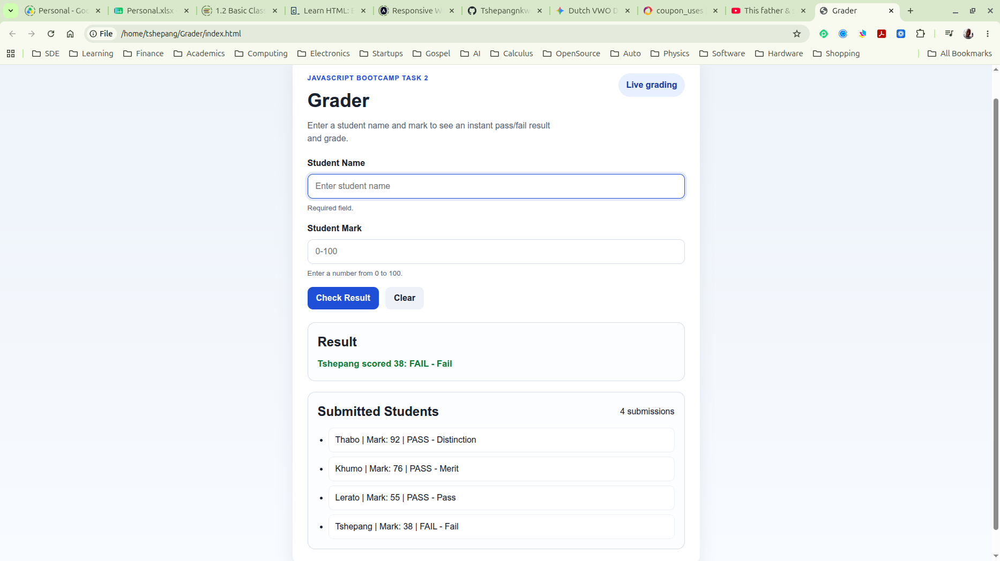

# Grader

## Overview

Grader is a single-page web application that allows a user to enter a student's name and mark, submit the form, and receive an instant pass/fail grade without reloading the page.

The project demonstrates core DOM manipulation skills: selecting elements, reading form values, applying control logic with conditional branching, and dynamically updating the page based on user input.

## Objective

Build a fully functional application that:
- Accepts a student name and a mark (0–100) from a form
- Validates all input before processing
- Uses JavaScript to determine the appropriate grade
- Displays a clear result on the same page without a page reload
- Keeps a running list of all submitted students with their results

## Grading Scale

| Mark Range | Result | Grade       |
|------------|--------|-------------|
| 80–100     | PASS   | Distinction |
| 65–79      | PASS   | Merit       |
| 50–64      | PASS   | Pass        |
| 0–49       | FAIL   | Fail        |

## Features Implemented

- HTML structure with name input, mark input, submit button, result area, and submission list.
- Validation for empty names, whitespace-only names, non-numeric marks, and marks outside 0–100.
- Grading logic using `if / else if / else`.
- DOM updates that show the latest result and append each successful submission to the list.
- Improved user experience with instant updates, cleared inputs after success, and focus returning to the name field.
- Accessibility support through proper labels and an `aria-live` result area.

## Technologies Used

- HTML5
- CSS3
- JavaScript (ES6+)

## Project Structure

```text
Grader/
├── index.html
├── style.css
├── script.js
└── README.md
```

## How to Run Locally

1. Clone the repository:
   ```bash
   git clone https://github.com/TShepangnkwe/Grader.git
   ```

2. Open the project folder:
   ```bash
   cd Grader
   ```

3. Open `index.html` in a web browser.

No build steps or server are required.

## How to Use

1. Enter a student name.
2. Enter a mark between 0 and 100.
3. Click **Check Result** or press **Enter**.
4. View the instant pass/fail result and grade.
5. See the submission added to the list below.

## Validation Rules

| Scenario | Behavior |
|----------|----------|
| Empty or whitespace-only name | Show an error message and highlight the name field |
| Mark empty, non-numeric, <0, or >100 | Show an error message and highlight the mark field |
| Valid name and mark | Calculate the grade, update the result area, append to the list, and clear the form |

## Testing

- Valid input like `John, 85` returns `PASS — Distinction`.
- Boundary values such as `80`, `79`, `65`, `64`, `50`, `49`, `0`, and `100` are handled correctly.
- Invalid names and invalid marks are rejected.
- Repeated submissions remain in the list.

## Accessibility Notes

- Every input has a matching `<label>`.
- The form supports Enter key submission.
- The result area uses `aria-live="polite"` so screen readers announce updates.

## Screenshot



## Submission Information

- GitHub repository: `https://github.com/TShepangnkwe/Grader`
- Due date: 01 June 2026
- Included files: `index.html`, `style.css`, `script.js`, `README.md`

## Author

Developed as part of the JavaScript Bootcamp Task 2.
